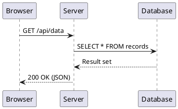

# Sequence3D

A 3D sequence diagram visualizer that renders PlantUML sequence diagrams as animated 3D scenes. Write your diagram, hit Play, and watch participants, lifelines, and messages come to life with smooth camera transitions.

**Try it live:** [https://sequence3d-64c75.web.app](https://sequence3d-64c75.web.app)

## Features

- Parse PlantUML sequence diagram syntax (`participant`, `actor`, `database`, `entity`, arrows)
- Animated 3D rendering with Three.js and GSAP
- Camera automatically frames each message as it animates
- Supports self-messages (loops back to the same participant)
- Sequence and system diagram modes
- Playback controls: play, pause, resume, reset, speed adjustment
- Orbit controls for free camera movement after animation completes
- Crisp text labels via CSS2D overlay

## Getting Started

### Prerequisites

- Node.js (v18+)

### Install & Run

```bash
npm install
npm run dev
```

Open `http://localhost:5173` in your browser.

### Build for Production

```bash
npm run build
npm run preview
```

## Usage

1. Write or paste a PlantUML sequence diagram in the editor panel
2. Click **Play** to animate the diagram in 3D
3. Use the speed controls to adjust animation speed
4. After animation completes, use your mouse to orbit around the scene

### Example



## Tech Stack

- **Three.js** - 3D rendering
- **GSAP** - Animation engine
- **TypeScript** - Type safety
- **Vite** - Build tool and dev server

## Project Structure

```
src/
  main.ts                 # App entry point and orchestration
  types.ts                # Shared types and layout constants
  parser/                 # PlantUML parsing
  layout/                 # Layout computation (positioning)
  scene/                  # Three.js object factories
  animation/              # GSAP timeline and camera control
  ui/                     # Editor panel and playback controls
```

## License

MIT
